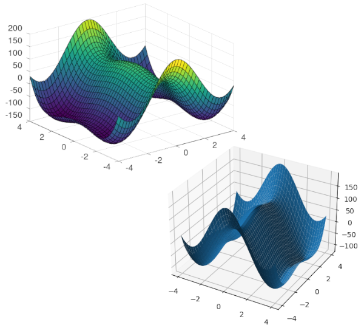

# MATLAB/SciPy Examples

   

A collection of small scripts demonstrating how to accomplish mathematical tasks in both [MATLAB](https://www.mathworks.com/products/matlab.html) (or [Octave](https://www.gnu.org/software/octave/index)) and in [Python](https://www.python.org/) using [SciPy](https://scipy.org/), [NumPy](https://numpy.org/), and [Matplotlib](https://matplotlib.org/).

## Description

This repo is primarily aimed at mathematicians and scientists whom are already used to using mathematical software packages for performing scientific computations, but whom wish to expand their options by working in a fully-fledged programming language. Commercial software packages can be somewhat limited in their functionality, and being able to perform the same tasks using a general programming language not only grants access to a much wider array of packages, but also allows these mathematical applications to be built into larger programs.

This repo contains a collection of example scripts to show how common mathematical tasks can be performed in MATLAB and in Python, with the goal of demonstrating how to convert a MATLAB program into an equivalent Python program. This is accomplished primarily through the use of the [`ndarray`](https://numpy.org/doc/stable/reference/generated/numpy.ndarray.html) object and the [`linalg`](https://numpy.org/doc/stable/reference/routines.linalg.html) module from [NumPy](https://numpy.org/), which provide a MATLAB-like syntax for working with matrices, and the [`pyplot`](https://matplotlib.org/stable/api/_as_gen/matplotlib.pyplot.html) module from [Matplotlib](https://matplotlib.org/), which provides a MATLAB-like syntax for creating plots.

Each subdirectory contains a MATLAB `.m` file alongside a Python `.py` file. The two files are meant to correspond to each other (line-for-line where possible) and to show how the same set of steps can be accomplished in each program. Currently only one example is included, but I expect to add more advanced demonstrations over time. The [**basics**](https://github.com/adam-rumpf/matlab-scipy-examples/tree/main/basics) example includes a variety of basic linear algebra commands (such as matrix and vector operations and solving linear systems), basic programming structures (such as loops, conditionals, and functions), and plotting commands.
